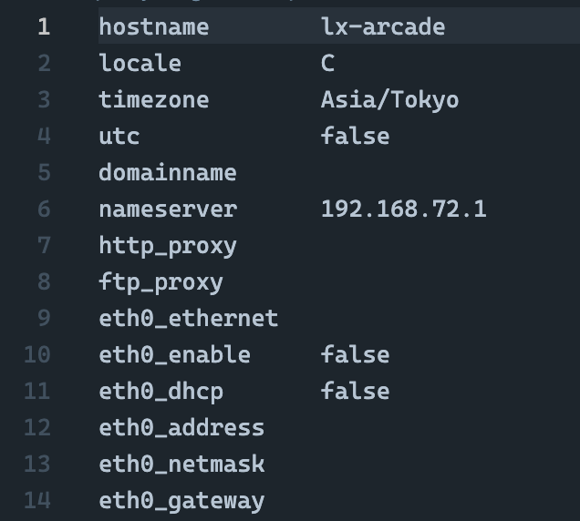
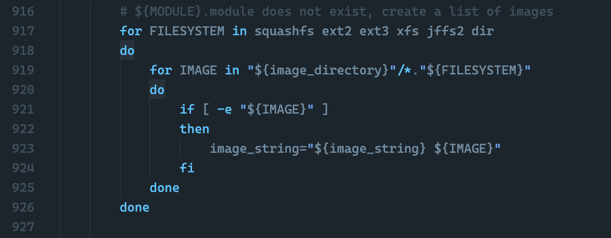

rES1gn
======

A dead-simple Namco System ES1 pure software exploit. No hardware required!

Overview
--------

The [Namco System ES1](https://ja.wikipedia.org/wiki/SYSTEM_ES1) is a Linux PC-based arcade base board released by Namco in 2009.
For more details on its workings and security architecture, I heartily recommend [this excellent writeup](https://medium.com/@ValdikSS/researching-protection-and-recovering-namco-system-es1-arcades-1f8423fdeb3b) by [@ValdikSS](https://twitter.com/ValdikSS),
as well as [my own notes](https://github.com/Shizmob/arcade-docs/blob/main/namco/boards.md#system-es1).

To protect its game contents, the System ES1 uses [TPM sealing](https://en.wikipedia.org/wiki/Trusted_Computing#SEALED-STORAGE):
briefly explained, a random key is generated the first time it boots (possibly in-factory), which is then used to encrypt the game.
The key is then stored inside the System ES1's TPM 1.2-compatible trust module, and *bound* to the current hardware and software state using the TPM's own [Platform Configuration Registers (PCR)](https://link.springer.com/chapter/10.1007/978-1-4302-6584-9_12). These are registers that can only be appended to, where `new-value = HASH(current-value || input)`. The first 15 of these registers are reserved for the core and static root of trust (CRTM and SRTM), and each is given a specific purpose. On subsequent boots, the TPM will *only* allow the key to be read if the values of its PCR registers match the values the key was bound to.

The boot chain
--------------

When the system boots, the BIOS measures itself and writes this value into PCR0, and starting there each component in the boot chain is responsible for measuring the next before executing it. This creates a **chain of trust**, which for the ES1 is built as follows:

- BIOS (PCR0, 1, 2, 3, measured by itself)
- [GRUB-IMA](https://sourceforge.net/projects/trousers/files/Grub-IMA/): a modified version of GRUB that takes PCR measurements (PCR4, 5, measured by partially the BIOS and partially itself)
- [various event logs] (PCR6, 7)
- Linux kernel + initrd + command line + rootfs: `filesystem.squashfs` (PCR8, measured by GRUB-IMA)
- ES1 configuration: `config` + ES1 partition table: `partab` (PCR9, measured by GRUB-IMA)

The System ES1(A2) slightly tweaks this chain:

- BIOS (PCR0, 1, 2, 3, measured by itself)
- GRUB-IMA (PCR4, 5, measured by partially the BIOS and partially itself)
- Linux bootstrap kernel: `arcadeboot` (PCR8, measured by GRUB-IMA)
- ES1 configuration: `config` + ES1 partition table: `partab` (PCR9, measured by GRUB-IMA)
- GPG key (PCR15, measured by GRUB-IMA)

In this setup, the bootstrap kernel has an embedded initrd, which then iterates over all block devices to find the GPG key in `/boot/arcadeboot.key` that matches the measurement in PCR15. If found and containing the user ID `boot-publisher`, it will use this to decrypt and run `/boot/arcadeboot.exec.gpg` on the same device, which usually is some script that does hash verification of the actual kernel, initrd and rootfs before `kexec`ing into with a hardcoded command line.

Both chains eventually end up in a Linux kernel with initrd. The Linux kernel seems custom-configured (with an `-arcade` suffix), but the initrd appears to be a standard Debian [Casper](https://tracker.debian.org/pkg/casper) initrd (used for LiveCD/USB boots in Debian 4.0, later replaced by [live-initramfs](https://tracker.debian.org/pkg/live-initramfs), then [live-boot](https://salsa.debian.org/live-team/live-boot)). After some miscellaneous setup, this initrd locates `filesystem.squashfs` and then pivots into it.

So far so good, right? The BIOS measures itself and GRUB, GRUB measures itself and the kernel, initrd, command line and rootfs: a perfect chain of trust, with nothing to come between! Furthermore, despite the kernel and rootfs being positively *ancient* at this point, and technically vulnerable to evergreen vulnerabilities such as [Shellshock](https://en.wikipedia.org/wiki/Shellshock_(software_bug)) (where would we be without bug branding!), there's another problem:

The system is actually decently locked down.

There's no fun running services or any interesting network traffic, a bunch of stuff is disabled at the kernel level, and in many configurations [it doesn't even do DHCP](https://www.rapid7.com/db/modules/exploit/unix/dhcp/bash_environment/). Nor can you force it to: the configuration file that governs this is *also* measured into a PCR.

So we can't change any of the BIOS, GRUB, kernel, initrd, *command line* and rootfs, or the PCR values will mismatch and we will not get our decryption key. Guess it's time for hardware attacks, right? A good [TPM bus sniff](https://twitter.com/marcan42/status/1080869868889501696) never hurt anyone, or worst-case just jam in a [Firewire or PCIe card and DMA your way in](https://medium.com/@ValdikSS/researching-protection-and-recovering-namco-system-es1-arcades-1f8423fdeb3b).

Well, I'm lazy, and also more of a software guy, really.

The missing link
----------------

A particularly attentive reader could note that in the overview above,
I left out *how* the initrd exactly locates the rootfs in `filesystem.squashfs`.
It turns out this detail is key: the initrd is the *sole* (semi-)standard Debian component Namco used in the bootchain,
and it's the system's entire downfall.

Take a look at the following part of `live`, a script from Casper, executed by the initrd to find its source images:

See, while GRUB-IMA happily measures `filesystem.squashfs`, Casper will happily load more than that. In fact, Casper will happily load *all* the images you can throw in there. What's worse, it will mount all of them under a single root using a [union mount](https://en.wikipedia.org/wiki/Union_mount). The "exploit" is basically free! Create a simple squashfs image (or just a directory ending in `.dir`) in the `/live` folder on the boot partition, and as long as it sorts below `filesystem.squashfs`, any file in there will overwrite any file on the original rootfs, without changing the PCR values.

PoC
---

This repository contains a PoC making use of this flaw. Make sure you have `mksquashfs` from squashfs-tools **3.x**, run `make res1gn.squashfs MKSQUASHFS=...` and dump `res1gn.squashfs` into `/live` on your System ES1 boot partition.

Overwriting `/sbin/init` in the original rootfs, it dumps the game key from the TPM and decrypts the game `.apps` container. It then gives you the choice to modify the boot partition in such a way to trigger the ES1's built-in recovery process that makes use of the plaintext `.app` container, causing that drive (or any image you take of it) to turn into a drive that encrypts itself against the target system at first boot. Just like in the factory.

Final words
-----------

The System ES1's security model is honestly pretty sound for its time: you can look all you want, but you can't touch, or you'll never get the key out of the TPM. Sure, you could sniff it, but this is 2009: there's systems out *now* whose security solely relies on a single TPM sniff, so it was definitely ahead of its time.

While they definitely also could've disabled Firewire in the kernel completely and remove any unused PCI(e) ports to mitigate some DMA attacks, if it weren't for Casper's silly behavioral oversight it would be the only arcade system from that era I've seen absolutely **need** a hardware attack. Chapeau!

Cool folks
----------

[@ValdikSS](https://twitter.com/ValdikSS) / [@dropkickshell](https://medium.com/@dropkickshell/system-n2-exposed-5395436c824d) / [@marcan42](https://twitter.com/marcan42) / gerg / [@_987123879113](https://twitter.com/_987123879113) / lots of other folks I'm forgetting

License
-------

[WTFPL](http://www.wtfpl.net/txt/copying/). Don't be the dipshit who uses this to sell bootlegs, emulators, or loaders.
If you enjoyed this, consider [visiting your local arcade when it's safe](https://zenius-i-vanisher.com/v5.2/arcades.php)!
